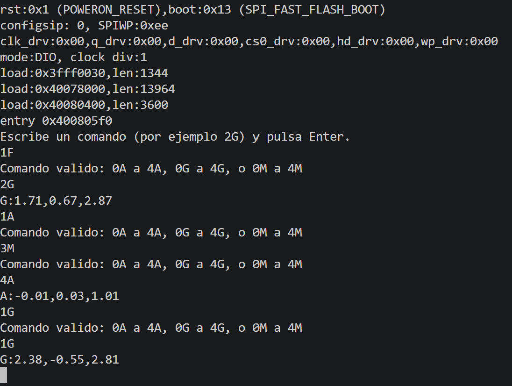

# P1_LAB — Arduino Nano 33 BLE

Prácticas de microcontroladores realizadas con <strong>PlatformIO</strong> y el <strong>Arduino Nano 33 BLE</strong>. Cada carpeta <code>P1_x_...</code> es un proyecto independiente: desde el parpadeo de un LED y la lectura del ADC hasta la comunicación entre un Nano y un ESP32 para consultar muestras de la IMU.

## Proyectos

| Carpeta | Qué hace el programa principal |
| --- | --- |
| [`P1_1_BLINK_LED`](P1_1_BLINK_LED/) | Enciende y apaga el LED del pin 13 cada segundo. |
| [`P1_2_LECTURA_ADC`](P1_2_LECTURA_ADC/) | Lee `A0`, convierte la lectura a milivoltios y la muestra por `Serial` cada segundo. |
| [`P1_3_INTERRUPCION_Y_ADC`](P1_3_INTERRUPCION_Y_ADC/) | Usa una interrupción periódica de `TIMER3` para solicitar una lectura ADC cada 10 segundos. |
| [`P1_4_PWM_desde_ADC`](P1_4_PWM_desde_ADC/) | Convierte la lectura de `A0` en el *duty cycle* de una salida PWM en `A1`, actualizada cada segundo. |
| [`P1_5_COMUNICACION_UART`](P1_5_COMUNICACION_UART/) | Recibe comandos por `Serial` para consultar el ADC, programar lecturas periódicas y ajustar la PWM. |
| [`P1_6_COMUNICACION_I2C`](P1_6_COMUNICACION_I2C/) + [`P1_6_ESCLAVO_I2C_ESP32`](P1_6_ESCLAVO_I2C_ESP32/) | El Nano actúa como maestro I²C y envía `0` o `1` al ESP32 esclavo para apagar o encender su LED. |
| [`P1_7_LECTURA_SENSORES_INTEGRADOS`](P1_7_LECTURA_SENSORES_INTEGRADOS/) | Lee acelerómetro, giróscopo y magnetómetro mediante `Arduino_LSM9DS1` e intenta mostrar las lecturas cada segundo. |
| [`P1_8_ENVIO_I2C_COMANDADO_DE_DATOS`](P1_8_ENVIO_I2C_COMANDADO_DE_DATOS/) + [`P1_8_ENVIO_COMANDO_ESP_MASTER`](P1_8_ENVIO_COMANDO_ESP_MASTER/) | El Nano guarda cinco muestras de la IMU y responde a las peticiones I²C de un ESP32 maestro. |

## Estructura y organización del código

Tras las primeras pruebas, el código se separó en archivos de cabecera dentro de <code>include/</code> e implementaciones dentro de <code>src/</code>. En <code>P1_3</code> los módulos ADC y temporizador todavía están en <code>lib/</code>; a partir de <code>P1_4</code> se usa la estructura por capas:

  

- `hal/`: acceso a ADC, PWM, temporizador y comunicaciones UART/I²C.
- `bsp/`: adaptación de la IMU integrada, presente en las prácticas con sensores.
- `app/`: interpretación de comandos y lógica de telemetría.
- `config.h`: pines y constantes usadas por cada proyecto.
- `main.cpp`: inicialización y ciclo principal de la práctica correspondiente.

Las carpetas son <strong>ejercicios sucesivos</strong>, por lo que algunas conservan módulos de prácticas anteriores aunque su <code>main.cpp</code> ya no los utilice. La descripción de la tabla se refiere al programa que se ejecuta en cada carpeta.

## ADC, temporizador y PWM

En <code>P1_2</code> se lee el pin <code>A0</code> y se calcula la tensión con <code>lectura * 3300 / 1023</code>, tomando 3,3 V como referencia. El valor aparece en milivoltios en el monitor serie.

**[Vídeo: lectura del ADC](docs/vid/ADC_READ.mp4)**

En <code>P1_3</code> se configura <code>TIMER3</code> del nRF52840 con un contador de 1 MHz. La rutina de interrupción activa una bandera y el <code>loop()</code> realiza la lectura del ADC cuando detecta esa bandera. Así se evita imprimir por <code>Serial</code> dentro de la interrupción.

En <code>P1_4</code> el ADC se configura a 12 bits (<code>0–4095</code>) y se escala a un duty de <code>0–255</code>. La salida PWM de <code>A1</code> se genera con <code>mbed::PwmOut</code> a <strong>7 kHz</strong>; el temporizador actualiza el duty una vez por segundo.

**[Vídeo: PWM controlada desde el ADC](docs/vid/ADC_to_PWM.mp4)**

## Comandos por Serial

En <code>P1_5_COMUNICACION_UART</code>, el Nano recibe líneas terminadas en salto de línea a <strong>115200 baudios</strong>. El programa reconoce:

| Comando | Acción |
| --- | --- |
| `ADC` | Detiene el temporizador y envía una lectura actual del ADC. |
| `ADC(x)` | Configura una lectura periódica cada `x` segundos mediante `TIMER3` si `x` es positivo. |
| `ADC(0)` | Detiene las lecturas periódicas. |
| `PWM(x)` | Ajusta el duty de `A1`, con `x` entre `0` y `9` (`0` = 0 %, `9` = 100 %). |
| `STOP` | Detiene el temporizador y fija la PWM a cero. |

Al recibir <code>ADC(0)</code>, el programa detiene el temporizador. El comando <code>ADC</code> también lo detiene y envía una lectura puntual; <code>STOP</code> lo detiene y, además, fija la salida PWM a cero.

## I²C: Nano maestro y ESP32 esclavo

En la primera prueba I²C, el Nano envía alternativamente los bytes <code>0</code> y <code>1</code> cada 500 ms a la dirección <strong><code>0x08</code></strong>. El ESP32 recibe el byte con <code>Wire.onReceive()</code> y apaga o enciende su LED. En el ESP32 se usan <strong>SDA = GPIO 21</strong> y <strong>SCL = GPIO 22</strong>. Ambas placas deben compartir masa y las señales I²C deben trabajar a 3,3 V.

  

## Lectura y consulta de la IMU

<code>P1_7</code> incorpora un módulo <code>bsp/IMU</code> para leer los tres ejes del acelerómetro, giróscopo y magnetómetro con <code>Arduino_LSM9DS1</code>. Su <code>loop()</code> llama a <code>printIMU()</code> una vez por segundo. <strong>En esta versión falta inicializar <code>Serial</code> en <code>setup()</code></strong>, por lo que la impresión no queda preparada para verse de forma fiable en el monitor hasta añadir <code>Serial.begin(...)</code>.

La práctica <code>P1_8</code> separa los papeles de las placas:

| Placa y carpeta | Función |
| --- | --- |
| Nano, [`P1_8_ENVIO_I2C_COMANDADO_DE_DATOS`](P1_8_ENVIO_I2C_COMANDADO_DE_DATOS/) | Esclavo I²C `0x33`. Guarda cinco muestras de aceleración, giro y campo magnético, una cada 200 ms después de arrancar. |
| ESP32, [`P1_8_ENVIO_COMANDO_ESP_MASTER`](P1_8_ENVIO_COMANDO_ESP_MASTER/) | Maestro I²C. Lee un comando escrito por `Serial`, lo envía al Nano y solicita su respuesta. Utiliza GPIO 21/22 para SDA/SCL y GPIO 2 para el LED. |

El comando tiene <strong>dos caracteres</strong>: índice <code>0–4</code> seguido de <code>A</code> (acelerómetro), <code>G</code> (giróscopo) o <code>M</code> (magnetómetro). Por ejemplo, <code>2G</code> pide los tres ejes del giróscopo de la muestra 2. El Nano prepara una respuesta de texto como <code>G:0.12,0.34,0.56</code>; el ESP32 la imprime y enciende su LED durante un segundo. El maestro espera 10 ms entre el envío del comando y la solicitud de lectura.

Las cinco muestras se capturan <strong>una sola vez al inicio</strong>, no en un búfer que se actualice continuamente. Si se consulta antes de terminar la captura, pueden recibirse muestras aún no tomadas. Las funciones de lectura de la IMU devuelven si había datos disponibles, pero la aplicación actual no comprueba ese resultado al guardarlos.

### Estructura del código de la última práctica

Esta práctica se divide en dos proyectos de PlatformIO: uno para el <strong>Nano 33 BLE, que actúa como esclavo I²C</strong>, y otro para el <strong>ESP32, que actúa como maestro</strong>. En el Nano, el código separa la lectura del sensor, la lógica de la aplicación y la comunicación:

| Archivo del Nano | Responsabilidad |
| --- | --- |
| `src/main.cpp` | Inicializa la IMU y el I²C en `0x33`. En el bucle guarda hasta cinco muestras, separadas 200 ms, y procesa las peticiones recibidas. |
| `src/bsp/IMU.cpp` | Accede al acelerómetro, giróscopo y magnetómetro mediante `Arduino_LSM9DS1`. |
| `src/app/telemetria.cpp` | Guarda las lecturas en `bufferIMU[5]` y prepara como texto los tres ejes solicitados. |
| `src/app/protocolo.cpp` | Comprueba que el comando tenga un índice de `0` a `4` y una letra `A`, `G` o `M`. |
| `src/hal/I2C.cpp` | Registra las funciones de recepción y respuesta de `Wire`, conserva el comando recibido y envía la respuesta preparada. |
| `include/` | Declara las funciones y las estructuras de datos usadas por los módulos. |

El proyecto del ESP32 concentra su lógica en <code>src/main.cpp</code>: lee el comando por el puerto serie, lo valida, lo envía al Nano por I²C y solicita la respuesta. Así, la secuencia completa es <strong>comando por Serial → ESP32 maestro → Nano esclavo → selección de la muestra → respuesta por I²C → impresión por Serial</strong>.

**[Vídeo: petición de datos por I²C](docs/vid/PIDO_DATOS_I2C.mp4)**

  <video
    src="https://github.com/user-attachments/assets/82f86e33-2795-400e-b5cd-e256bfe9941e"
    controls
    width="75%">
  </video>

